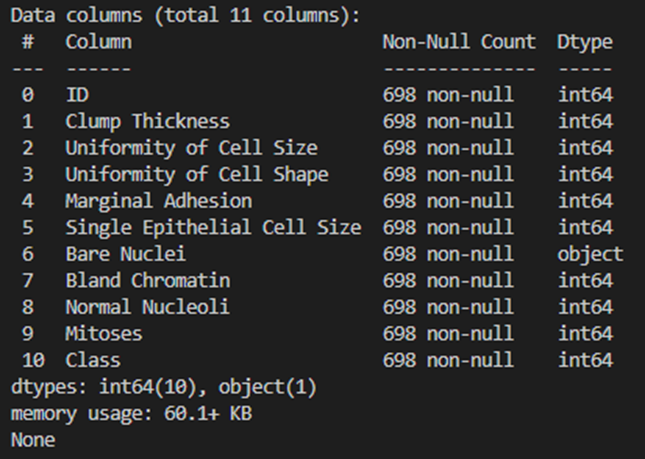

# 제목 없음

**data information**

**score about extra tree classifier**

**Score about selectKBest**

We decided to use columns without ‘ID’ and ‘Mitoses’

**Result about KFold K = 3**

**Result about KFold K = 5**

**Result about KFold K = 7**

**Top 10 Score result**

**(In top 5 Case only have model : svc, so we select top 10 result.)**

**Structure about giant function**

**Name : Model_function(scalers,models,x_train, x_test, y_train, y_test, k)**

**Parameters**

****Scalers : Scalers list that scaling dataset

Models : Models list that train dataset

x_train, x_test, y_train, y_test : test, train dataset that want to train by model

k : integer value to use by KFold K

**Return**

****Result : Dataframe that store used scalers, models, KFold K, Best score, Parameter of each train time.

**Note**

****This function is for people who want to train dataset by several scalers and models at once.

**Conclusion**

**Select Feature :** In feature selection, our team run 2 kinds of feature selection library, selectKBest and extratreeclassifier. But we get confused because results of 2 library are different. But there are similar point which column name ‘Mistoses” have poor score in both. So we decided to use columns without “Mistoses

**About Scaling :** In a result we can see that result that with scaling and without scaling are have not big different. In our opinion, this dataset’s columns have value only in same range 1 – 10, so results are not big different.

**Select the best :** We have confuse to select the best because not only top 10 scores but also almost all results are higher than 0.95, and similar. In our opinion, SVM Model is the best model for this dataset.