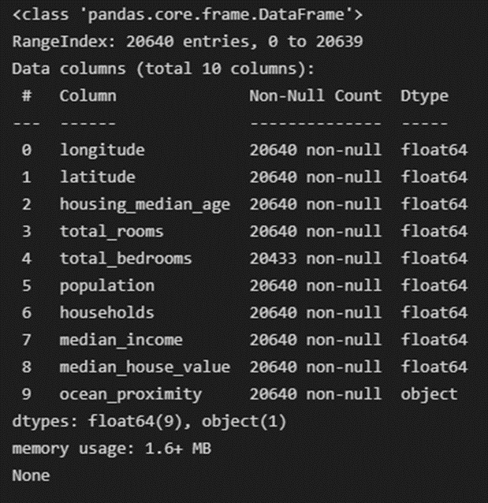

# Lab_2 Report

**Explanation of AutoML function**

AutoML()

**Parameters:**

**scalers**

List of scalers (List type), Define in main function

[StandardScaler(), MinMaxScaler(), RobustScaler()]

**models**

List of models (List type, string), Define in main function

[‘KMeans’, ‘EM(GMM)’, ’DBSCAN’, ‘Spectral’, ‘CLARANS’]

**encoders**

List of encoders (List type), Define in main function

[LabelEncoder(), OrdinalEncoder()]

**data**

data frame that use in function (pd.DataFrame type)

**scaleruse**

The number of scalers that want to use, default = 3

Default case use 3 kinds of scalers (Standard, MinMax, Robust scalers)

Lower case than 3, pop scaler from list one by one

**algouse**

The number of algorithms that want to use, default = 5

Default case use 5 kinds of algorithms (KMeans, EM(GMM), DBSCAN, Spectral, CLARANS)

Lower case than 5, pop algorithm from list one by one

**encoderuse**

The number of encoders that want to use, default = 2

Default case use 2 kinds of algorithms (Label, Ordinal encoders)

Lower case than 2, pop encoder from list one by one

**n_clusters**

The number list that want to divide cluster, default = None

It used in each algorithm function

**Process:**

Check scaleruse, encoderuse, algouse to setting scalers and encoders and algorithms to use.

For each combination of encoder and scaler do :

Run algorithm and display the result of clustering

**Explanation of algorithm function**

General algorithm function()

**Parameters:**

**feature**

feature to use for clustering

**realvalue**

real value to compute purity score, In this lab ‘median_house_value’

**num_cluster**

number of cluster to divide data, default = None

If default it set number of cluster [2, 4, 6, 8, 10]

(Not use in DBSCAN)

**Process:**

Setting the parameters for each clustering algorithm (ex : number of clusters, using algorithm, covariance, radius of eps etc)

Use pca algorithm to plot result of cluster

For each combination of parameters(number of cluster, algorithm etc) do :

Run algorithm library function

Store data and plot result at big plot window

Return plot result

**data information**

**Analysis**

**Output**

Figure 1 – K-Means with Standard Scaler

Figure 2 – CLARANS with Standard Scaler

Figure 3 – EM(GMM) with Standard Scaler

Figure 4 – DBSCAN with Standard Scaler

Figure 5 – Spectral with Standard Scaler

In each clustering algorithm we plot data like above, by combination of parameters.

By our “eyeball’ analysis EM and K-Means seems make clusters better than others.

First we run AutoML function with all features.

After we plot the result of clustering, we compare the result with divide data by column “median_house_value”. And we can find that the result of clustering **is not exactly match to columns ‘Median_house_value'.** Some clusters have too many data and some clusters are too small data. But it means not exactly match but in some cases it seems meaningful clustering results. For example clustering results seems similarly divide in 4 clusters case in k=4 in K-Means algorithm like below.

Figure 6 – K-Means with MinMax Scaler

And we find that clustering results are all different by scalers, features, kind of algorithm like input parameters of algorithm. First picture is standardscaler, second is minmaxscaler.

While we analysis the result of clustering we found that **too many cluster number (k) make confusion cluster.**

After plot the result of clustering, we were check which combination is seem best.

**General**

In general clustering algorithm, we think clustering result from MinMax scaler are best like above picture. We think because the results from MinMax scaler are most scattered.

And also we think k is 2 or 4 is best cluster. If k is bigger than those, cluster border is tricky.

**Selected Feature**

After run AutoML function with all features, we run that without ‘longitude’, ‘latitude’, ‘housing_median_age’, ‘total_bedrooms’ the result of that seems like below.

Figure 7 – K-Means with Selected Features

We think the shape of cluster is very strange. By this we learn that select feature to use in algorithm is important and very hard part of clustering.

**Contribution**

When we do this programming lab, at first we try to programming individually. But after spending about 3 days. We cannot get result clearly so we work together. We search how to use clustering algorithm, and parameters etc at google, and stackoverflow site.

**Conclusion**

In conclude we learn that clustering is very difficult to use and analysis. We think that because clustering is unsupervised so it depends on our work.

From this lab we have huge difficult at making AutoML function. By hardcoding, run clustering library one by one is not difficult work but merge the code and make automatic function like library is obstacle for us. So we learn from several web site like scikit-learn and stack overflow.

After work we are going to fix that and want to contribute people who learn and try to run clustering algorithm.

**Useful site**

Scikit-learn homepage : [https://scikit-learn.org/stable/index.html](https://scikit-learn.org/stable/index.html)

Stack overflow : [https://stackoverflow.com/](https://stackoverflow.com/)