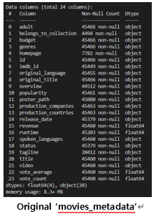

# Movie_Recommendation_System

1. **Objective**

Today, we can find and watch old movies on OTT as well as new movies in theaters. If we watch a movie that is not interesting at this time, we will not feel good. We tried to create a movie recommendation system for these people.

1. **Data description**
    - **Data Source**

We used 'The Movies Dataset’ from Kaggle. Dataset files contain metadata for 45000 movies listed in the Full MovieLens dataset. And also it contain 26 million ratings from 270000 users for all 45000 movies. But in this project, we use ratings_small dataset that contain about 110000 ratings from 671 users for movies.

- **Original Dataset Inspection**

**name** : movies_metadata.csv

**size**: 24 columns X 45000 rows

**columns** = [ ‘adult’, ‘belong_to_collection’, ‘budget’, ‘genres’, ‘hompage’, ‘id’, ‘imdb_id’, ‘original_language’, ‘original_title’, ‘overview’, ‘popularity’, … ‘title’, ‘vote_average’, ‘vote_count’ ]

**name** : ratings_small.csv

**size**: 4 columns X 100000 rows

**columns** = [ ‘userId’, ‘movieId’, ‘rating’, ‘timestamp’ ]

In preprocessing, we are going to handle data to make our recommendation system

1. **Data preprocessing**
    - **Data preprocessing**

There are too many columns that we will not use to make systems. So we drop several columns. And we handle about missing data. If movies have no ‘title’, ‘movieId’ or ‘genres’ we drop rows, and others we fill value by NaN

And also column ‘genres’ have data shape like dictionary so we convert data to string type. (Cause we use vectorize and calculate cosine similarity from that)

- **Each model use different shape of data**

While we make movie recommendation system, we use several models, for example ‘content based filtering’, ‘collaborative filtering’, and ‘association rules mining’. For learning or making models, data shape that each models require are all different. So we processing data in each models function. We will describe it on modeling parts.

1. **Modeling**

In this part we are going to describe data shape that each models use and how recommendation system work. And finally simple output about recommendation from the models.

- **Content Based Filtering**

The idea of content based filtering recommendation is if user input the title of movie, we recommend the movie that have similar or same genres. In this model, we just use ‘movies_metadata.csv’ and the column ‘genre’.

Use TfidVectorizer() to vectorize column ‘genre’ and calculate cosine similarity to find movies that have similar genre. And display 10 movies that have similar genre.

Left picture of below is the recommendation result from movie ‘The Hours’, and right picture is the result from movie ‘Toy Story’. This model is based on similar of genre, so we can seem that recommended movies are have almost same genre

- **Collaborative filtering (Item-Based)**

The idea of collaborative filtering (Item-Based) is that ‘Items that have similar rating distribution, will be similar each other’. So in this model use both dataset ‘movies_metadata.csv’ and ‘ratings_small.csv’. In below chart, Item A and Item B have similar ratings distribution from users, so we consider two items are similar, so recommend item A to user 4.

At first, we merge two dataset and we make pivot table from title, userId, ratings from the dataset. And calculate similarity of each items by cosine similarity. Finally model display top 10 movies that have highest similarity result.

Left picture of below is the recommendation result from movie ‘The Hours’, and right picture is the result from movie ‘Batman Returns’.

- **Collaborative filtering (Matrix Factorization)**

The idea of Collaborative filtering (Matrix Factorization) is that predict rating by matrix factorization and recommend 10 movies that have highest predict rating. So in this model use both dataset ‘movies_metadata.csv’ and ‘ratings_small.csv’.

At first, we merge two dataset and we make pivot table from title, userId, ratings from the dataset. Next factorize matrix to predict user ratings by using SVD. Below picture is predict ratings table.

Left picture of below is the recommendation result from userId ‘100’, and right picture is the result from userId ‘73’.

- **Association rules mining (Apriori)**

The idea of Association rules mining, make rules of input movie, and display top 10 movie rules that have highest left score. In this model we make new type of data. If user rating, it user watch (1), if user have no rating or 0 rating, it user not watch(0). We make dataset like below.

From this we make rules about input movie. In this case we should 2 thresholds of ‘min support’ and ‘min left’.

Left picture of below is the recommendation result from movie ‘The Hours’, and right picture is the result from movie ‘Batman Returns’.

1. **Evaluation and analysis**

In social, evaluations about recommendation systems is pretty simple, money. It is successful if sales have increased due to the use of the recommendation system, and it is not successful if sales have not increased.

But in our level (students), we think it is difficult to evaluate. So in this project, we evaluate and analysis program according to our standards. For example, input movie that we interested in and predict which movie will recommended. And compare to output.

At first is content based filtering. We input movie ‘Iron Man 2’ that we interested in. We expected Iron man series or marble movie. In 10 movies of result have iron man series but it just based on genres, it seems not good.

Second is Apriori algorithm. Also of this case, we input movie ‘Iron Man 2’ but the result said it have no rules about it. From this result, we analysis that in apriori algorithm, we have to adjust or select appropriate threshold.

We can fix by use threshold about low value, in this case it spent long time to calculate, so we just maintain our threshold.

Third is Apriori and item based. We find that result from two models are similar. By checking dataset and analysis, we have result about that. The idea about item-based is similar ratings distribution are similar item so it consider whether user watch that movie or not, so result of two are similar.

Fourth is Matrix Factorization. In this case we make our own ratings movie dataset that we watched before. Above we said ratings dataset have data about 671 users, so we are going to be user 672th. We ratings movie ‘The Martian’, ‘Snowpiercer’, ‘Jurassic World’, ‘IpMan’ etc. And we expected SF, history genre movies. But the result is not what we expected. From this we think the data that we ratings are too small, and we need more large dataset to good predict.

Last we are going to compare with real movie site, ‘rottentomatoes.com’, ‘cine21.com’, ‘Netflix(Korea, Japan, USA)’.

We have no match between our recommendation system and real movie domain site. We analysis about this result.

In content based, we just consider so its accuracy is low. In the case of item based and apriori, we use ratings dataset that only have 671 users. So we think because of lack of dataset make this bad result. In addition our movie dataset is not updated since 2017, so it can be caused bad result too.

In addition in this section we recognize that same domain(Netflix), and different region have different recommend.

1. **Open Source SW Contribution**

We make module about our movie recommendation system. Each models use different shape of data, so in each model, get dataset and preprocessing. After that use algorithm and display result.

In collaborative filtering (item-based), parameters is movie title that want to find similar movie. Read two dataset and preprocessing. After make data, calculate cosine similarity and print 10 similar movies.

In matrix factorization parameters is movie title that want to find similar movie. Read two dataset and preprocessing. It use SVD to predict rating about movies that user not watched before. And print 10 recommend movies.

In content based filtering, parameters is movie title that want to find similar movie. Read one dataset ‘movies_metadata’. Vectoriezed ‘genre’ column and calculate cosine similarity. And print 10 similar movies that have similar genres.

In apriori, parameters is movie title that want to find similar movie and min_sup value. Read two dataset and preprocessing the data. And then make rules about the input movie and print 10 movies that have highest left score.

1. **Learning Experience**

While we doing term project, we experience big data end-to-end process. And we learn and feel a lot of things from project.

We learned how to use Big Data process. And we learned that importance of preprocessing because of modeling results are have huge different by human’s preprocessing.

After make models, and while evaluation of our models, we get challenge. The result of our recommendation system doesn’t match to real movie domain, ‘rottentomatoes.com’, ‘cine21’, ‘Netflix’. From this we can learn amount of dataset is also important.

While doing this project, although the result (accuracy) is not good we learn end-to-end process and consider, think about how to use dataset, and how to preprocessing. In addition how to use open sources to fit our objective.